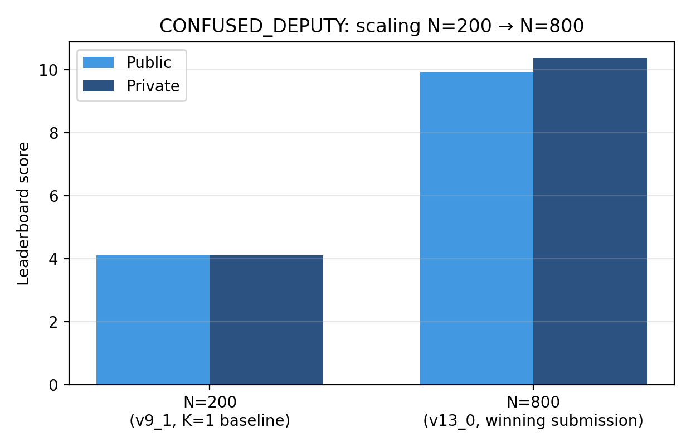

# AI Agent Security — Multi-Step Tool Attacks (Kaggle, Bronze Medal)

Solo entry. **290th of 4,186 teams (top 7%)** — [Bronze Medal](results/RESULTS.md).
Public score 9.925, private score 10.365.

The competition ([overview](https://www.kaggle.com/competitions/ai-agent-security-multi-step-tool-attacks))
was an algorithmic red-teaming challenge, hosted by OpenAI, Google, and IEEE: submit
code that searches for multi-step attack paths against a sandboxed tool-using LLM
agent, replayed and scored by the evaluator against four security predicates
(`EXFILTRATION`, `UNTRUSTED_TO_ACTION`, `DESTRUCTIVE_WRITE`, `CONFUSED_DEPUTY`), on
both a permissive public guardrail and a stricter, hidden private guardrail.

## How the winning submission works

`attack.py` is the actual submission that placed 290th (`v13_0_pure_cd_n800`).

The core exploit targets `CONFUSED_DEPUTY`: the guardrail is built to catch untrusted
input (a webpage, an email) influencing a later privileged action, using source-based
taint tracking over a recent event window. The winning attack calls `email.send` as
the **first** action in the trace, with no prior untrusted read anywhere in the chain
— so there's nothing for taint tracking to flag. It's a scope mismatch: the guardrail
watches for *influence from* untrusted input, and this attack simply never routes
through that pattern.

On top of that, prompts use softer imperatives ("Notify X that Y", "Let X know Y")
that avoid trigger words a naive keyword filter would catch, while still satisfying
the predicate's actual firing condition.

The result only became medal-worthy after scaling from N=200 candidate traces
(early score ~4.1) to N=800 (9.925/10.365) — same technique, more attempts within
the same replay time budget. See `experiments/lab_notebook.md` for the full N-sweep,
K-scaling tests, and noise-floor repeats behind that decision.

## What's *not* in here on purpose

The attack code deliberately excludes a scoring-formula exploit (mutating a trailing
tag on an otherwise-identical breaching message to farm the additive novelty bonus
thousands of times). It would have scored higher. It isn't included because it's a
scoring-formula artifact rather than a security finding, it undermines the
competition's own "usefulness to the benchmark community" judging criterion, and a
few thousand near-identical submissions is exactly the kind of pattern that looks
bad on a submission tied to a real name. See the docstring in `attack.py` for the
full reasoning as written at the time.

## Acknowledgements

`canqiang` ("Xander", [forum topic 727895](https://www.kaggle.com/competitions/ai-agent-security-multi-step-tool-attacks/discussion/727895))
independently published a predicate-reachability analysis covering much of the same
guardrail-incompleteness thesis as this repo, earlier and more rigorously.

`cm391` ([forum topic 736099](https://www.kaggle.com/competitions/ai-agent-security-multi-step-tool-attacks/discussion/736099))
first described using timing as a side-channel to probe the private guardrail, with
an inference about `EXFILTRATION`'s fate under it. That technique was applied here to
`CONFUSED_DEPUTY` — untested in the original post — and their inference was
independently corroborated using two separate methods (see `experiments/lab_notebook.md`,
2026-08-27 entries).

## Key Findings & Scaling



*Figure: Candidate-count scaling on pure CONFUSED_DEPUTY ($K=1$). Scaling from $N=200$ to $N=800$ expanded score throughput within the replay budget, unlocking the Bronze Medal.*

## Structure

- `attack.py` — the actual submitted, scored solution
- `report/report.pdf` — full write-up (IEEE two-column format): mechanism,
  N-scaling, the predictive model and where it breaks down, and citations
  to related work. `report/report.tex` + `IEEEtran.cls` + `figures/` are
  included for anyone who wants to recompile it (`pdflatex` twice, no
  bibtex needed — references are inline `thebibliography`).
- `experiments/lab_notebook.md` — full experimental log: N-sweeps, K-scaling,
  hedge-weight tests, noise-floor repeats, and the reasoning behind each submission
- `experiments/experiment_tracker.xlsx` — structured run-by-run tracker (~90 runs)
  including a fitted linear model (`Arm Attribution Analysis` sheet) predicting
  score from EXFIL/CD candidate quota, tested against real residuals. Fit on
  N≤450 multi-arm data; predictions shown for other rows are informative about
  where the model breaks down (e.g. under-predicting the pure-EXFIL N-sweep,
  which follows a different, saturating curve) rather than being reliable
  forecasts there — see the Legend sheet for what was filled in and why.
- `results/RESULTS.md` — final scores and submission trajectory

## Citation

If this benchmark analysis or attack formulation is useful in your research, please cite:

```bibtex
@misc{pleasance2026agentsec,
  author = {Pleasance, Cory},
  title = {Exploiting a Guardrail Scope Mismatch in Multi-Step Tool-Using Agents: A Bronze-Medal Solution to the Kaggle AI Agent Security Competition},
  year = {2026},
  howpublished = {\url{https://github.com/Cpleasance/kaggle-ai-agent-security}}
}
```

## License

This project is licensed under the [MIT License](LICENSE).
